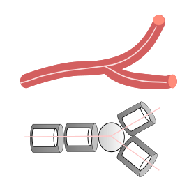

# README
    
## Preprocessing: Preparing the input geometry

Preparing the geometry required for solving the transport physics involves conversion of the 3D vascular geometry into a weighted graph. The format for specifying topology information of the vascular network is found in [input.xlsx](https://github.com/DeepaMahm/simgraph/tree/main/input).
The specifics of the column fields provided in the spreadsheet are detailed below.

*****************************************************

#### Step 1:   Original graph geomerty
The reconstructed 3D volume of the microvasculatue is translated into a graph represented by nodes and edges (or vessel segments). Nodes represent terminal ends or junctions at which n-furcation of blood vessels occur. The edges are oriented in the direction of flow and each edge is formed by a tail (t) and head (h) node. The
inputs required to form the weighted graph are:  
 
Example: <br />


<!--  -->

Here, 1, 2, 3, and 4 are the nodes labels. (1,2), (2,3), (3,4) are the edges.

The following 11 fileds are the column headers present in the spreadsheet. These values in these fileds are extracted from the skeletonized
version of the vascular geometry.<br />
* t - tail <br />
* h - head	 <br />
* r - radius of the vessel segment formed by (tail, head)	 <br />
* d - diameter of the vessel segment formed by (tail, head)	 <br />
* l - length of the vessel segment formed by (tail, head)	 <br />
* xpos -	x-coordinate of a node <br />
* ypos - 	y-coordinate of a node <br />
* zpos -  z-coordinate of a node	 <br />
* nodes(index) - index/numbering of the graph nodes  <br /> 	
* hNode - inlet node at which fluid enters the domain (e.g. 1)  <br />	
* tNode - outlet node at which fluid leaves the domain (e.g. 4)	 <br />

*****************************************************

#### Step 2: Discretizing graph domain

* nodes_mesh - index/numbering of nodes in the discretized domain  <br />
* xpos_mesh - x-coordinate of nodes in the discretized domain	 <br />
* ypos_mesh - y-coordinate of nodes in the discretized domain	 <br />
* zpos_mesh - z-coordinate of nodes in the discretized domain <br />
* segment_i_nnode	- no of intermediate(i) nodes between each head and tail nodes in the a given segment. e.g if 2 nodes
 (labelled 5 and 6) are added between (1, 2) segment_i_nnode=2. <br />

* *volume_ratio and other extras (computed internally, not user defined)*	 <br />

The topology data of four vasculatures studied in our work are available in the workbooks of the input file. For carring out simulations with new vasculatures, add a workbook and populate the topology information corresponding to the 11 fields mentioned in Step 1. Next, generate the data of the first 5 column fields mentioned in Step 2 via [read_mesh.py](https://github.com/DeepaMahm/simgraph/blob/main/preprocessing/read_mesh.py) which discretizes the domain using Gmsh library. read_mesh.py generates the coordinates of the mesh elements making use of the minimum and maximum bounds of element size specified by the user. Copy the output saved in [data_model.xlsx](https://github.com/DeepaMahm/simgraph/blob/main/preprocessing/data_model.xlsx) and update the coordinate information of the discretized domain in the input spreadsheet prior to simulation. The data is read from the input file by the executable [main.exe](https://github.com/DeepaMahm/simgraph/blob/main/main/main.exe) and the computational domain is created for proceeding with the static and dynamic simulation runs.

*****************************************************
## Simulation
*Generation of the metamodel, mathematical formulation and simulation is carried out in [main.exe](https://github.com/DeepaMahm/simgraph/blob/main/main/main.exe)*

#### Step 3: Setting up the computational domain for multiphysics simulation
The static flow field is computed considering a cylindrial geometry. For modelling the dynamics of biochemical drift in the vascular domain, each node in the discretized blood vessel domain is modelled as an approximation of a volume element. The height of the cylinder(l) is equal to mesh size. The diameter of the cylinder (d) is equal to the diameter of the blood vessel that is modelled. The blood vessel volume element is surrounded by a monolayer of β-cell mass. The volum of this monolayer is approximated by the volume of a hollow cylinder also referred to as donut volume.  The idea is to treat each volume element like a continuous stirred tank reactor (CSTR). Convection , diffusion and reaction is modeled by writing mole balance equation for each volume element. The reaction nodes are highlighted in  green on the left image. Coupling between the donut element and the cylindrical volume element in the blood occurs at the green colored nodes. The bifurcation and trifurcation junctions are treated as spherical volume elements.
 
<!--   -->


#### Step 4: Simulation of static flow fields and transient concentration dynamics 

Boundary conditions and the settings related to the choice of dynamic simulation (advection-dispersion physics or advection-dispersion-reaction physics) can be modified in [settings_utils.m](https://github.com/DeepaMahm/simgraph/blob/main/input/settings_utils.m)


## Postprocessing


Output files:

*File naming convention for mat files.*

e.g test1_default_bc1_v1_c2

{graph}_{mesh}_{boundary condition}_{no. of species in blood vessel}_{no. of species in cell}


Naming convection used: 
advection diffusion: {species}_{tool}_{physics}

species =  glc_ext/lac_ext/glc_cell/lac_cell
tool = simgraph/comsol
physics = ad/sink/' '/eq

e.g.
*  ad(advection diffusion) :  glc_ext_comosl_ad
*  sink( irreversible) : glc_ext_comsol_sink
*  ' ' (convection + diffusion + reaction): glc_ext_comsol
* 	eq (convection + diffusion + reaction - blood vessel and cell have equal volumes): glc_ext_comsol_eq 
* 	eqfull (convection + diffusion + reaction - blood vessel and cell have equal volumes): glc_ext_comsol_eqfull 
*  full (convection + diffusion + reaction - blood vessel and cell have unequal volumes): glc_ext_comsol_full 


The 3D visualization are created via [manuscript_figures.py](https://github.com/DeepaMahm/simgraph/blob/main/postprocessing/manuscript_figures.py).


###### Download 

```
git clone https://github.com/DeepaMahm/simgraph.git
```

###### Execution in MATLAB command line
```
cd simgraph/main
main.exe input.xlsx settings_utils.m
```

